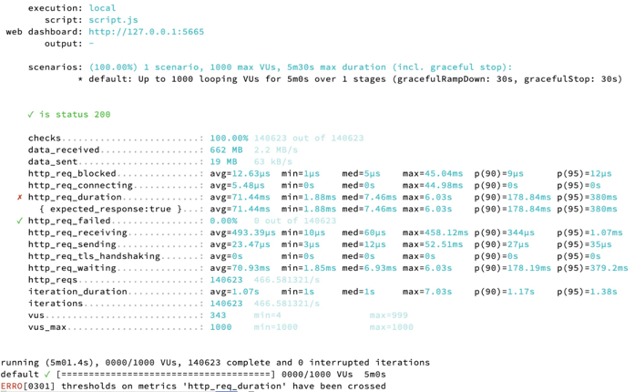

## Multi Module Design
Module을 나누는 기준은 여러 개가 있지만, 이번 프로젝트에서는 Layered Architecture 에서 설명되는 Layer 별로 구분하였습니다.
- api: 사용자의 요청을 받고, 응답한다. 
  - 본래, presentation과 application 두 개의 모듈로 분리되어있던 구조를 수정하였습니다.
  - 사용자의 요청을 받고 처리한다는 점에서, Error와 Response를 한 곳에서 관리하기 위함입니다.
- domain: 시스템이 제공할 도메인 규칙을 구현한다.
- infra: 외부 시스템과의 연동을 담당한다.
- 본래 존재하였던 core 모듈을 삭제하였습니다.
  - 실제로 공통 역할이 아니지만 core(or common) 모듈에 패키지를 생성해서 정의하는 경우를 방지하기 위함입니다.
  - 현재까지의 요구사항에서는 core 모듈에 들어갈 기능이 없다고 판단되었습니다.

각 module은 하위 module에만 의존합니다.  
JPA 를 다른 ORM 으로 변경될 가능성은 낮다고 판단하여 PA 는 생산성을 위해서 Entity 와 Repository 를 Domain 으로 끌어 올려 사용하였습니다.
JPA 를 제외한 나머지는 저수준의 변경사항으로 부터 고수준을 지키는 방식을 사용합니다.

## Table Design

- Movie 테이블과 Theater 테이블은 N:N 관계로 중간에 Screening 테이블을 두고 있습니다.
  - Theater 별로 시간표가 구분되는 것을 고려하여 Screening 테이블은 상영 시간표 정보를 포함하고 있습니다.
- 좌석별 등급 등 좌석 개별의 특성이 추가될 수 있다고 생각하여 Seat 테이블을 생성하였습니다.
- Theater 테이블과 Seat 테이블은 1:N 관계입니다.
- Seat 테이블과 Reservation 테이블은 1:1 관계입니다.
  - 공유 자원인 Seat과 행위인 Reservation을 분리하기 위함입니다.
- Reservation 테이블과 User 테이블은 1:1 관계입니다.

## N+1 문제 해결
저는 N+1 문제가 ID 참조을 사용하기 때문이라고 생각합니다. 따라서 해당 프로젝트에 간접참조를 사용하여, N+1 문제를 해결하고자 합니다. 
뿐만 아니라, 간접 참조를 사용하면 도메인 간 물리적인 연결을 제거하기 때문에 도메인 간 의존을 강제적으로 제거되고, FK의 데이터 정합성을 따지기 위한 성능 오버헤드를 줄이며, 데이터 수정 시의 작업 순서가 강제됨에 따라 발생하는 더 큰 수정 개발을 방지할 수 있습니다.

대신, 애플리케이션 단에서 무결성 관리를 관리하도록 합니다. (삽입/수정/삭제)