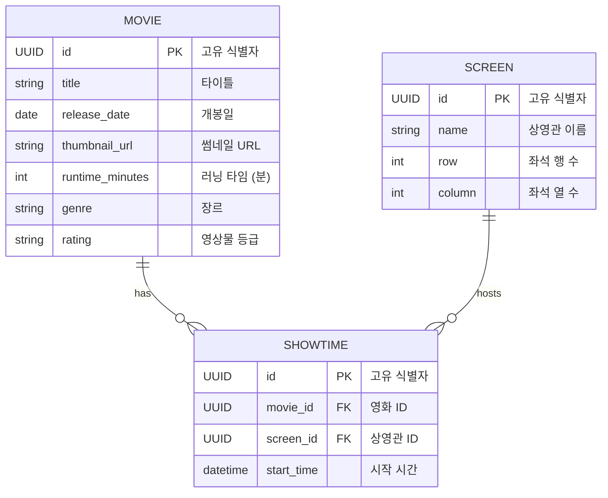

## [본 과정] 이커머스 핵심 프로세스 구현

[단기 스킬업 Redis 교육 과정](https://hh-skillup.oopy.io/) 을 통해 상품 조회 및 주문 과정을 구현하며 현업에서 발생하는 문제를 Redis의 핵심 기술을 통해 해결합니다.
> Indexing, Caching을 통한 성능 개선 / 단계별 락 구현을 통한 동시성 이슈 해결 (낙관적/비관적 락, 분산락 등)

## 멀티 모듈 구조

Clean Architecture 구조를 참조하여 4개의 멀티 모듈을 구성했습니다.

- api
    - HTTP 요청을 처리하기 위한 RestController 코드가 위치합니다.
    - 요청, 응답을 위한 DTO 코드가 위치합니다.

- application
    - 특정 비지니스 시나리오를 처리하기 위한 유즈케이스 코드가 위치합니다.
    - 도메인들이 조합된 특정 비지니스 시나리오의 DTO 코드가 위치합니다.

- domain
    - 도메인 객체와 공통 서비스 코드가 위치합니다.
    - 외부 의존성이 필요한 작업들에 대한 인터페이스 코드가 위치합니다. (예, Repository)

- infrastructure
    - 외부 의존성을 가지는 인터페이스 구현체가 존재합니다.

## 테이블 디자인



## API 디자인

GET /movies

- Description: 상영 중인 영화를 조회하는 API
- Response
    - 200
        - Array
            - movie_id: 영화 고유 식별자
            - title: 타이틀
            - rating: 영상물 등급
            - genre: 장르
            - release_date: 개봉일
            - thumbnail_url: 썸네일 URL
            - runtime_minutes: 러닝 타임(분)
            - screens: Array
                - screen_id: 상영관 고유 식별자
                - screen_name: 상영관 이름
                - row: 좌석 행 수
                - column: 좌석 열 수
                - show_times: Array
                    - show_time_id: 상영 시간 고유 식별자
                    - start_time: 상영 시간 ID
        - 개봉일 순으로 정렬

## 성능 테스트

### 사전 요구사항

- [k6 설치](https://grafana.com/docs/k6/latest/set-up/install-k6/)

### 스크립트 실행

```sh
k6 run performance_test/[with_title || without_title].js --summary-trend-stats="avg,min,med,max,p(90),p(95),p(99)"
```

### 성능 테스트 보고서 (http_req_duration 매트릭 기준)

- 100 max VUs, 1m30s max duration
- 10개 영화관, 10개 상영관, 500개 상영 시간

| API 종류                | AVG      | MIN     | MED       | MAX      | p90     | p95     | p99      |
|-----------------------|----------|---------|-----------|----------|---------|---------|----------|
| 전체 조회 API             | 623.62ms | 	9.19ms | 	262.42ms | 	5.18s   | 	2.21s  | 	3.58s  | 	4.5s    |
| title 검색 API (인덱스 없음) | 11.61ms  | 635µs   | 4.62ms    | 207.08ms | 20.14ms | 30.4ms  | 189.38ms |
| title 검색 API (인덱스 있음) | 16.16ms  | 624µs   | 5.02ms    | 343.06ms | 19.6ms  | 28.42ms | 332.71ms |
| 전체 조히 API (로컬 캐시)     |          |         |           |          |         |         |          |
| title 검색 API (로컬 캐시)  |          |         |           |          |         |         |          |
| 전체 조히 API (로컬 캐시)     |          |         |           |          |         |         |          |
| title 검색 API (분산 캐시)  |          |         |           |          |         |         |          |

LIKE 검색 시 전/후방 검색(%%)을 진행하기 때문에 인덱스 효과는 없는 것으로 보임
