## [본 과정] 이커머스 핵심 프로세스 구현
[단기 스킬업 Redis 교육 과정](https://hh-skillup.oopy.io/) 을 통해 상품 조회 및 주문 과정을 구현하며 현업에서 발생하는 문제를 Redis의 핵심 기술을 통해 해결합니다.
> Indexing, Caching을 통한 성능 개선 / 단계별 락 구현을 통한 동시성 이슈 해결 (낙관적/비관적 락, 분산락 등)

# 1. 1주차 쿼리
## 쿼리
다음은 현재 상영중인 영화 조회 API의 쿼리이다.

```sql
"select m from Movie m where m.releaseDate < NOW()"

"select new org.example.dto.ScreenInfoProjection(sr.name, ss.startTime, ss.endTime) " +
        "from ScreenSchedule ss " +
        "join Movie m on m.id = ss.movieId " +
        "join ScreenRoom sr on sr.id = ss.screenRoomId " +
        "where m.id = :movieId"
```

## 실행 계획
```
DAU = 100;
averageConnectionsPerUser = 2; // 사용자당 평균 접속 수
totalRequestsPerDay = 100 * 2 = 200; // 하루 총 요청 수
averageRPS = 200 / 86400 = 0.002; // 평균 RPS
peakRPS = 0.002 * 10 = 0.02; // 최대 RPS
```
- 최대 TPS = 0.02
- VU = 100으로 부하테스트 돌렸을 때 최대 TPS가 0.02까지 나오는지 확인 할 예정이다.

```jsx
export const options = {
  stages: [
    { duration: '5m', target: 100 } // 5분 동안 사용자 수 100명 증가시킨다
  ],
	thresholds: {
	  http_req_duration: ['p(95)<200'], // 95%의 요청이 200ms 이내에 응답해야 함
	  http_req_failed: ['rate<0.01'],   // 실패율은 1% 미만이어야 함
	},
}

export default function() {
  let res = http.get('http://localhost:8080/movies/playing');
  check(res, {
    'is status 200': (r) => r.status === 200,
  });
  sleep(1);
}
```
- 위 스크립트로 k6 부하테스트를 실행 할 예정이다.

## 부하 테스트 결과 (스크린샷)

- p(95)의 응답 소요 시간이 4.66s로 실행 계획 때 설정했던 임계값(200ms)을 넘는다.
- 실패율은 0% 이다.

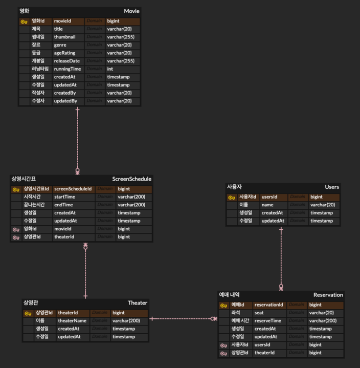
- 1초당 최대 처리량은 16.2개이다.

# 2. 검색 기능 추가 (index 적용 전)
```java
@Query("select new org.example.dto.MovieScreeningInfo" +
        "(m.id, m.title, m.thumbnail, m.genre, m.ageRating, m.releaseDate, m.runningTime, sr.name, ss.startTime, ss.endTime) " +
        "from Movie m " +
        "join ScreenSchedule ss on m.id = ss.movieId " +
        "join ScreenRoom sr on ss.screenRoomId = sr.id  " +
        "where (:title IS NULL OR m.title LIKE %:title%) " +
        "AND (:genre IS NULL OR m.genre = :genre) " +
        "And (m.isPlaying = :isPlaying)")
List<MovieScreeningInfo> findScreeningInfos(@Param("title") String title, @Param("genre") Genre genre, @Param("isPlaying") boolean isPlaying);
```

## 실행 계획

```
DAU = 1000;
averageConnectionsPerUser = 2; // 사용자당 평균 접속 수
totalRequestsPerDay = 1000 * 2 = 2000; // 하루 총 요청 수
averageRPS = 2000 / 86400 = 0.02; // 평균 RPS
peakRPS = 0.01 * 10 = 0.2; // 최대 RPS
```
- 최대 TPS = 0.2
- VU = 1000 부하테스트 돌렸을 때 최대 TPS가 0.2까지 나오는지 확인 할 예정이다.

```jsx
export const options = {
  stages: [
    { duration: '5m', target: 1000 } // 5분 동안 사용자 수 1000명 증가시킨다
  ],
	thresholds: {
	  http_req_duration: ['p(95)<200'], // 95%의 요청이 200ms 이내에 응답해야 함
	  http_req_failed: ['rate<0.01'],   // 실패율은 1% 미만이어야 함
	},
}

export default function() {
  let res = http.get('http://localhost:8080/movies/playing?movieTitle=A&genre=SF&playing=true');
  check(res, {
    'is status 200': (r) => r.status === 200,
  });
  sleep(1);
}
```
- 위 스크립트로 k6 부하테스트를 실행 할 예정이다.

## 부하 테스트 결과 (스크린샷)
### 검색 필터 적용한 데이터 조회


- p(95)의 응답 소요 시간이 380ms로 실행 계획 때 설정했던 임계값(200ms)을 넘는다.
- 실패율은 0% 이다.

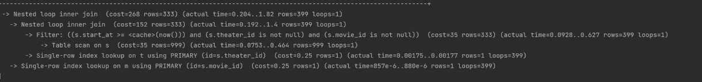
- 최대 TPS는 808.9 이다.

# 3. 검색 기능 추가 (index 적용 후)
## 적용한 인덱스 DDL

```sql
create index title_genre_isPlaying_idx on movie (genre, title);

create index title_idx on movie (title);
```

## 쿼리

### LIKE 연산

```java
@Query("select new org.example.dto.MovieScreeningInfo" +
        "(m.id, m.title, m.thumbnail, m.genre, m.ageRating, m.releaseDate, m.runningTime, sr.name, ss.startTime, ss.endTime) " +
        "from Movie m " +
        "join ScreenSchedule ss on m.id = ss.movieId " +
        "join ScreenRoom sr on ss.screenRoomId = sr.id  " +
        "where (:title IS NULL OR m.title LIKE %:title%) " +
        "AND (:genre IS NULL OR m.genre = :genre) " +
        "And (m.isPlaying = :isPlaying)")
List<MovieScreeningInfo> findScreeningInfos(@Param("title") String title, @Param("genre") Genre genre, @Param("isPlaying") boolean isPlaying);
```

### 동등 연산

```java
@Query("select new org.example.dto.MovieScreeningInfo" +
        "(m.id, m.title, m.thumbnail, m.genre, m.ageRating, m.releaseDate, m.runningTime, sr.name, ss.startTime, ss.endTime) " +
        "from Movie m " +
        "join ScreenSchedule ss on m.id = ss.movieId " +
        "join ScreenRoom sr on ss.screenRoomId = sr.id  " +
        "where (:title IS NULL OR m.title=:title) " +
        "AND (:genre IS NULL OR m.genre = :genre) " +
        "And (m.isPlaying = :isPlaying)")
List<MovieScreeningInfo> findScreeningInfos(@Param("title") String title, @Param("genre") Genre genre, @Param("isPlaying") boolean isPlaying);
```

## 실행 계획

### LIKE 연산
```
DAU = 1000; 
averageConnectionsPerUser = 2; // 사용자당 평균 접속 수
totalRequestsPerDay = 1000 * 2 = 2000; // 하루 총 요청 수
averageRPS = 2000 / 86400 = 0.02; // 평균 RPS
peakRPS = 0.01 * 10 = 0.2; // 최대 RPS
```
- 최대 TPS = 0.2
- VU = 1000 부하테스트 돌렸을 때 최대 TPS가 0.2까지 나오는지 확인 할 예정이다.

```jsx
export const options = {
  stages: [
    { duration: '5m', target: 1000 } // 5분 동안 사용자 수 1000명 증가시킨다
  ],
	thresholds: {
	  http_req_duration: ['p(95)<200'], // 95%의 요청이 200ms 이내에 응답해야 함
	  http_req_failed: ['rate<0.01'],   // 실패율은 1% 미만이어야 함
	},
}

export default function() {
  let res = http.get('http://localhost:8080/movies/playing?movieTitle=A&genre=SF&playing=true');
  check(res, {
    'is status 200': (r) => r.status === 200,
  });
  sleep(1);
}
```
- 위 스크립트로 k6 부하테스트를 실행 할 예정이다.

### 동등 연산

```
DAU = 1000;
averageConnectionsPerUser = 2; // 사용자당 평균 접속 수
totalRequestsPerDay = 1000 * 2 = 2000; // 하루 총 요청 수
averageRPS = 2000 / 86400 = 0.02; // 평균 RPS
peakRPS = 0.01 * 10 = 0.2; // 최대 RPS
```
- 최대 TPS = 0.2
- VU = 1000 부하테스트 돌렸을 때 최대 TPS가 0.2까지 나오는지 확인 할 예정이다.

```jsx
export const options = {
  stages: [
    { duration: '5m', target: 1000 } // 5분 동안 사용자 수 1000명 증가시킨다
  ],
	thresholds: {
	  http_req_duration: ['p(95)<200'], // 95%의 요청이 200ms 이내에 응답해야 함
	  http_req_failed: ['rate<0.01'],   // 실패율은 1% 미만이어야 함
	},
}

export default function() {
  let res = http.get('http://localhost:8080/movies/playing?movieTitle=A&genre=SF&playing=true');
  check(res, {
    'is status 200': (r) => r.status === 200,
  });
  sleep(1);
}
```
- 위 스크립트로 k6 부하테스트를 실행 할 예정이다.

## 부하 테스트 결과 (스크린샷)

### LIKE 연산
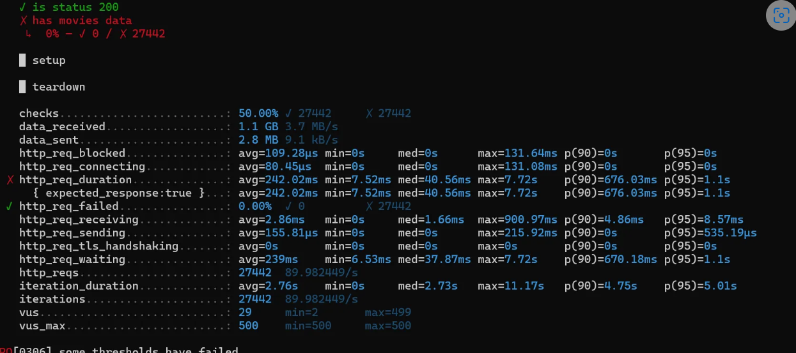
- VU = 1000으로 했을 때 p(95)의 응답 소요 시간이 94.13ms로 실행 계획 때 설정했던 임계값(200ms)을 넘지 않는다.
- 실패율은 0% 이다.

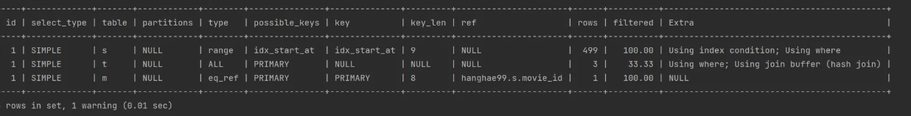
- VU = 1500으로 했을 때는 p(95)의 응답 소요 시간이 553.3ms로 실행 계획 때 설정했던 임계값(200ms)을 넘는다.
- 실패율은 0% 이다.

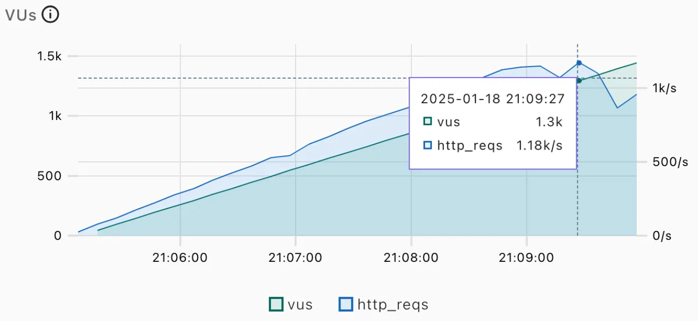
- 최대 TPS는 1.18K 이다.

### 동등 연산
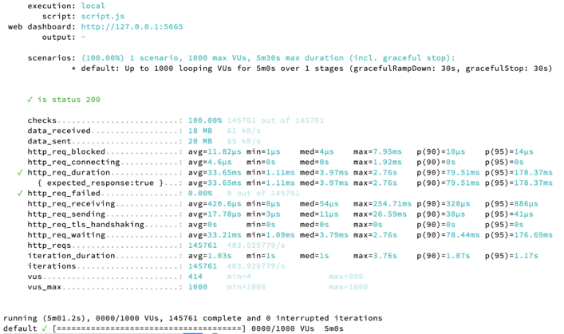
- VU = 1000으로 했을 때 p(95)의 응답 소요 시간이 178.37ms로 실행 계획 때 설정했던 임계값(200ms)을 넘지 않는다.
- 실패율은 0% 이다.


- VU = 2000으로 했을 때 p(95)의 응답 소요 시간이 396.7ms로 실행 계획 때 설정했던 임계값(200ms)을 넘는다.
- 실패율은 0% 이다.

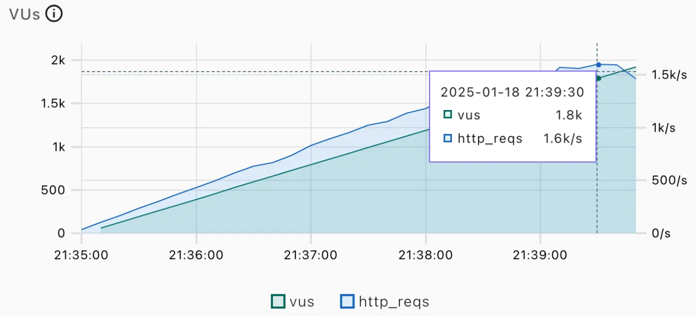
- 최대 TPS는 1.6K이다.

# 4. 로컬 Caching 적용 후

## 캐싱한 데이터의 종류
PlayingMoviesResponseDto 리스트를 캐싱했다.

```
캐시 이름: playingMovies
캐시 키: InceptionACTIONtrue
캐싱된 값:
[
    {
        "title": "Inception",
        "thumbnail": "https://example.com/inception_thumbnail.jpg",
        "genre": "ACTION",
        "ageRating": "PG-13",
        "releaseDate": "2010-07-16",
        "runningTime": 148,
        "screeningInfos": [
            {
                "screenRoomName": "Room 1",
                "screeningTimeInfos": [
                    {"startTime": "2023-01-18T12:00:00", "endTime": "2023-01-18T14:28:00"},
                    {"startTime": "2023-01-18T15:00:00", "endTime": "2023-01-18T17:28:00"}
                ]
            },
            {
                "screenRoomName": "Room 2",
                "screeningTimeInfos": [
                    {"startTime": "2023-01-18T18:00:00", "endTime": "2023-01-18T20:28:00"}
                ]
            }
        ]
    }
]
```

## 실행 계획

```
DAU = 5000; 
averageConnectionsPerUser = 2; // 사용자당 평균 접속 수
totalRequestsPerDay = 5000 * 2 = 10000; // 하루 총 요청 수
averageRPS = 10000 / 86400 = 0.1; // 평균 RPS
peakRPS = 0.1 * 10 = 1; // 최대 RPS
```
- 최대 TPS = 1
- VU = 5000 부하테스트 돌렸을 때 최대 TPS가 1까지 나오는지 확인 할 예정이다.

```jsx
export const options = {
  stages: [
    { duration: '5m', target: 5000 } // 5분 동안 사용자 수 5000명 증가시킨다
  ],
	thresholds: {
	  http_req_duration: ['p(95)<200'], // 95%의 요청이 200ms 이내에 응답해야 함
	  http_req_failed: ['rate<0.01'],   // 실패율은 1% 미만이어야 함
	},
}

export default function() {
  let res = http.get('http://localhost:8080/movies/playing?movieTitle=A&genre=SF&playing=true');
  check(res, {
    'is status 200': (r) => r.status === 200,
  });
  sleep(1);
}
```
- 위 스크립트로 k6 부하테스트를 실행 할 예정이다.

## 부하 테스트 결과 (스크린샷)
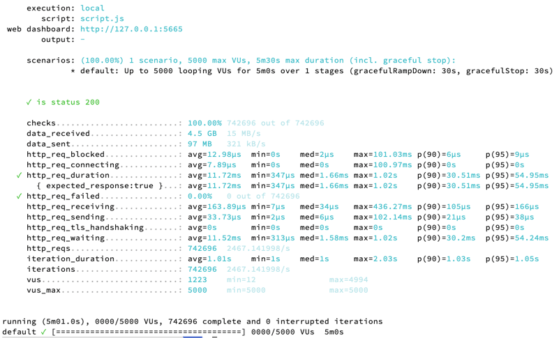
- VU = 5000으로 했을 때 p(95)의 응답 소요 시간이 54.95ms로 실행 계획 때 설정했던 임계값(200ms)을 넘지 않는다.
- 실패율은 0% 이다.

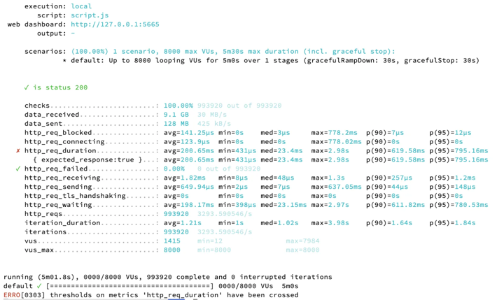
- VU = 8000으로 했을 때 p(95)의 응답 소요 시간이 795.16ms로 실행 계획 때 설정했던 임계값(200ms)을 넘는다.
- 실패율은 0% 이다.

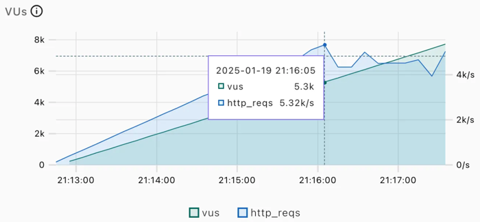
- 최대 TPS는 5.32K 이다.

# 5. 분산 Caching 적용 후

## 캐싱한 데이터의 종류
PlayingMoviesResponseDto 리스트를 캐싱했다.

```
캐시 이름: playingMovies
캐시 키: InceptionACTIONtrue
캐싱된 값:
[
    {
        "title": "Inception",
        "thumbnail": "https://example.com/inception_thumbnail.jpg",
        "genre": "ACTION",
        "ageRating": "PG-13",
        "releaseDate": "2010-07-16",
        "runningTime": 148,
        "screeningInfos": [
            {
                "screenRoomName": "Room 1",
                "screeningTimeInfos": [
                    {"startTime": "2023-01-18T12:00:00", "endTime": "2023-01-18T14:28:00"},
                    {"startTime": "2023-01-18T15:00:00", "endTime": "2023-01-18T17:28:00"}
                ]
            },
            {
                "screenRoomName": "Room 2",
                "screeningTimeInfos": [
                    {"startTime": "2023-01-18T18:00:00", "endTime": "2023-01-18T20:28:00"}
                ]
            }
        ]
    }
]
```

## 실행 계획

```
DAU = 5000; 
averageConnectionsPerUser = 2; // 사용자당 평균 접속 수
totalRequestsPerDay = 5000 * 2 = 10000; // 하루 총 요청 수
averageRPS = 10000 / 86400 = 0.1; // 평균 RPS
peakRPS = 0.1 * 10 = 1; // 최대 RPS
```
- 최대 TPS = 1
- VU = 5000 부하테스트 돌렸을 때 최대 TPS가 1까지 나오는지 확인 할 예정이다.

```jsx
export const options = {
  stages: [
    { duration: '5m', target: 5000 }  // 5분 동안 사용자 수 5000명 증가시킨다
  ],
	thresholds: {
	  http_req_duration: ['p(95)<200'], // 95%의 요청이 200ms 이내에 응답해야 함
	  http_req_failed: ['rate<0.01'],   // 실패율은 1% 미만이어야 함
	},
}

export default function() {
  let res = http.get('http://localhost:8080/movies/playing?movieTitle=A&genre=SF&playing=true');
  check(res, {
    'is status 200': (r) => r.status === 200,
  });
  sleep(1);
}
```
- 위 스크립트로 k6 부하테스트를 실행 할 예정이다.

## 부하 테스트 결과 (스크린샷)
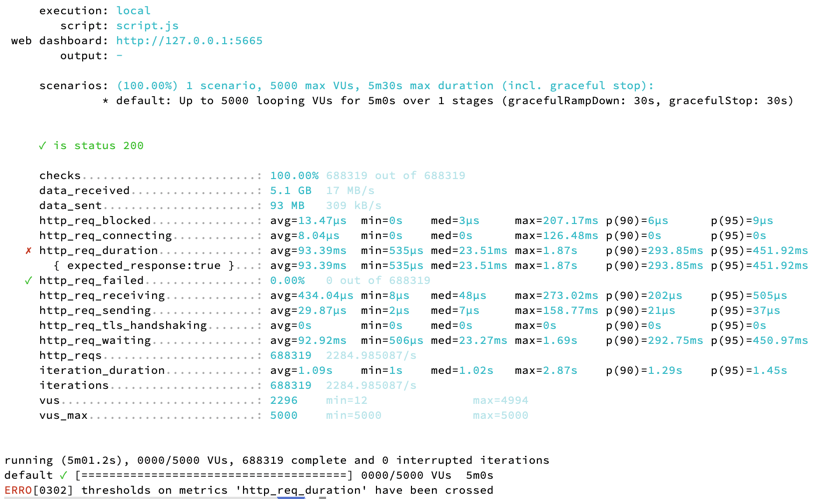
- VU = 5000으로 했을 때 p(95)의 응답 소요 시간이 451.92ms로 실행 계획 때 설정했던 임계값(200ms)을 넘는다.
- 실패율은 0% 이다.

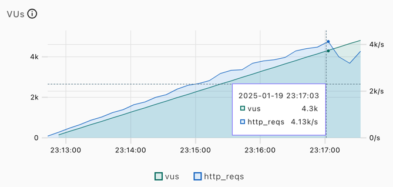
- 최대 TPS는 4.13K 이다.