## [본 과정] 이커머스 핵심 프로세스 구현

<details>
  <summary style="font-weight: bold; font-size: 17px;">멀티모듈 구성 및 요구사항 구현</summary>

## ERD

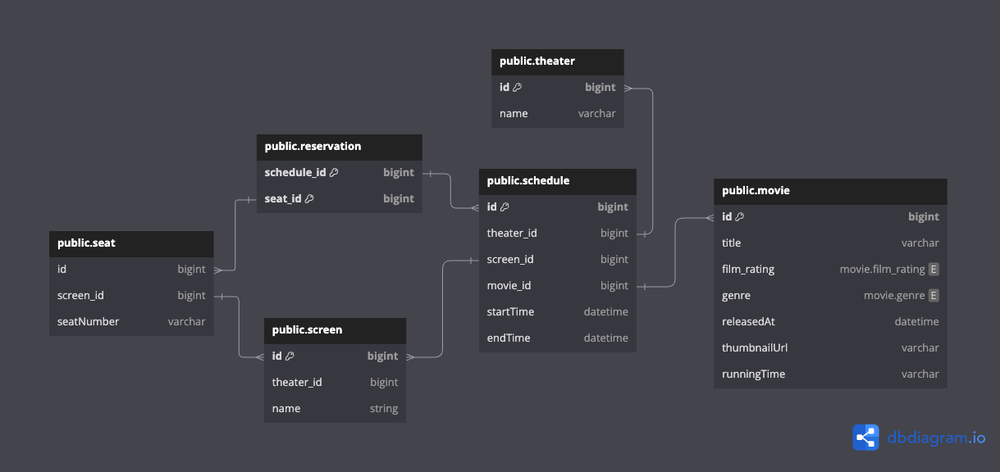

### 테이블 구성

- movie : 영화의 기본정보
- theater : 영화관 정보
- screen: 영화관의 상영관 정보
- schedule: 상영관의 일정표
- reservation: 영화예매 정보
- seat: 좌석 정보

## 멀티 모듈 구성도

```vi
├── movie-api/
│   └── interfaces/
│       ├── dto
│       └── controller
│
├── movie-domain/
│   ├── enums
│   ├── exception
│   ├── movie/
│   │   └── domain/
│   │       ├── movie 관련 POJO domain
│   │       ├── dto
│   │       ├── service
│   │       └── repository
│   ├── response
│   └── userAccount
│
├── movie-storage/
│   ├── config
│   ├── movie/
│   │   ├── mapper
│   │   ├── repository/
│   │   │   ├── JpaRepository
│   │   │   └── RepositoryImpl
│   │   └── entity/
│   │       └── MovieEntity
│   └── userAccount
│
└── movie-infrastructures/
    └── ... redis 추가를 위한 모듈
```
- movie-api
  - 외부와 통신을 담당하는 interfaces 영역으로 분리
- movie-domain
  - layered architecture 및 도메인 중심적인 관심사 분리를 위한 clean architecture 구성
- movie-storage
  - 도메인의 DI를 적용하기 위해 persistence layer 분리
  - 추후 디비 구성 변경을 용이하게 하기 위한 구성
  - NoSql을 추가 가능하도록 추가함
- movie-infrastructure
  - redis, kafka 등 인프라를 구성하기 위한 모듈

## 응답 api 구성

- url : /api/schedules?theaterId=1
- response
```json
GET http://localhost:8080/api/schedule?theaterId=1

HTTP/1.1 200 

{
  "resultCode": "SUCCESS",
  "result": [
    {
      "id": 1,
      "theater": {
        "id": 1,
        "name": "A영화관"
      },
      "screen": {
        "id": 1,
        "theaterId": 1,
        "name": "1관"
      },
      "movie": {
        "id": 1,
        "title": "범죄도시",
        "releaseDate": "2025-01-01T00:00:00",
        "thumbnailUrl": "http://thumbnailA.png",
        "runningTime": "120",
        "filmRating": "R_15",
        "genre": "ACTION"
      },
      "timeTables": [
        {
          "startDate": "2025-01-08T08:00:00",
          "endDate": "2025-01-08T10:00:00"
        },
        {
          "startDate": "2025-01-08T10:00:00",
          "endDate": "2025-01-08T12:00:00"
        },
        {
          "startDate": "2025-01-08T12:00:00",
          "endDate": "2025-01-08T14:00:00"
        },
        {
          "startDate": "2025-01-08T14:00:00",
          "endDate": "2025-01-08T16:00:00"
        },
        {
          "startDate": "2025-01-08T16:00:00",
          "endDate": "2025-01-08T18:00:00"
        },
        {
          "startDate": "2025-01-08T18:00:00",
          "endDate": "2025-01-08T20:00:00"
        },
        {
          "startDate": "2025-01-08T20:00:00",
          "endDate": "2025-01-08T22:00:00"
        },
        {
          "startDate": "2025-01-08T22:00:00",
          "endDate": "2025-01-08T23:00:00"
        }
      ]
    },

    ...
```

</details>


<details>
  <summary style="font-weight: bold; font-size: 17px;">index를 적용한 DB 검색 최적화 작업 및 부하테스트</summary>

<details>
  <summary style="font-weight: bold; font-size: 15px;">테스트 환경</summary>

#### 데미 데이스 수량

|    | 영화관 | 상영관   | 스케줄     | 영화  |
|----|-----|-------|---------|-----|
| 데이터 수량 | 100 | 1,000 | 100,000 | 500 |

> - 하나의 영화관은 10개의 상양관을 가진다.
> - 하나의 상영관은 랜덤한 하나의 영화를 가지며, 10개의 스케줄을 가진다.
> - 영화는 랜덤한 5개의 장르중 하나를 가지며, 2024-12-01 ~ 12-31가지의 랜덤한 개봉일을 가진다.

#### 부하 테스트

영화1 ~ 영화500 중 랜덤한 영화명 and 5개의 장르중 랜덤한 하나의 장르를 검색 조건으로 가진다. 

</details>

<details>
  <summary style="font-weight: bold; font-size: 15px;">모든 영화 스케줄 조회 - 메인 페이지</summary>

#### 쿼리

```sql
select
    se2_0.id,
    se2_0.created_at,
    se2_0.created_by,
    se2_0.modified_at,
    se2_0.modified_by,
    se2_0.name,
    se2_0.theater_id,
    se1_0.id,
    te1_0.id,
    te1_0.name,
    me1_0.id,
    me1_0.title,
    me1_0.film_rating,
    me1_0.genre,
    me1_0.released_at,
    me1_0.thumbnail_url,
    me1_0.running_time,
    se1_0.start_time,
    se1_0.end_time
from
    schedule se1_0
join theater te1_0 on te1_0.id=se1_0.theater_id
join screen se2_0 on se2_0.id=se1_0.screen_id
join movie me1_0 on me1_0.id=se1_0.movie_id
order by
    me1_0.released_at
```

#### 인덱스 적용전 실행계획

| id | select\_type | table | partitions | type | possible\_keys | key | key\_len | ref | rows | filtered | Extra |
| :--- | :--- | :--- | :--- | :--- | :--- | :--- | :--- | :--- | :--- | :--- | :--- |
| 1 | SIMPLE | se1\_0 | null | ALL | null | null | null | null | 99528 | 100 | Using where; Using temporary; Using filesort |
| 1 | SIMPLE | me1\_0 | null | eq\_ref | PRIMARY | PRIMARY | 8 | movie02.se1\_0.movie\_id | 1 | 100 | null |
| 1 | SIMPLE | te1\_0 | null | eq\_ref | PRIMARY | PRIMARY | 8 | movie02.se1\_0.theater\_id | 1 | 100 | null |
| 1 | SIMPLE | se2\_0 | null | eq\_ref | PRIMARY | PRIMARY | 8 | movie02.se1\_0.screen\_id | 1 | 100 | null |

#### 부하 테스트 결과

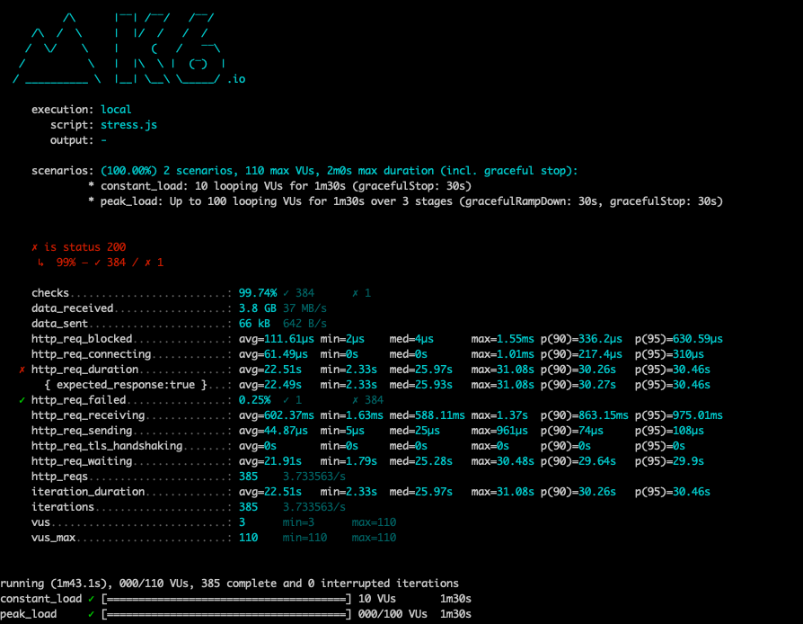

</details>

<details>
  <summary style="font-weight: bold; font-size: 15px;">검색 조건을 적용한 영화 스케줄 조회</summary>

### 개요

영화명과 영화 장를를 이용한 검색 비교시  단일 인덱스 or 복합 인덱스를 적용한 조회 성능을 비교하고자 한다.  

- 쿼리

```sql
select
    se2_0.id, se2_0.created_at, se2_0.created_by, se2_0.modified_at, se2_0.modified_by, se2_0.name,
    se2_0.theater_id, se1_0.id, te1_0.id, te1_0.name, me1_0.id, me1_0.title,
    me1_0.film_rating, me1_0.genre, me1_0.released_at, me1_0.thumbnail_url,
    me1_0.running_time, se1_0.start_time, se1_0.end_time
from
    schedule se1_0
    join theater te1_0 on te1_0.id=se1_0.theater_id
    join screen se2_0 on se2_0.id=se1_0.screen_id
    join movie me1_0 on me1_0.id=se1_0.movie_id
where me1_0.title like '영화10%'
    and me1_0.genre = 'ACTION'
order by
    me1_0.released_at
```

### movie 단일 인덱스

- 적용한 인덱스 DDL

```sql
create index idx_movie_genre on movie(genre);
create index idx_movie_title on movie(title);
create index idx_movie_released on movie(released_at);
```

- 실행계획

| id | select\_type | table | partitions | type | possible\_keys | key | key\_len | ref | rows | filtered | Extra |
| :--- | :--- | :--- | :--- | :--- | :--- | :--- | :--- | :--- | :--- | :--- | :--- |
| 1 | SIMPLE | me1\_0 | null | ref | PRIMARY,idx\_movie\_genre,idx\_movie\_title | idx\_movie\_genre | 82 | const | 96 | 22.2 | Using where; Using filesort |
| 1 | SIMPLE | se1\_0 | null | ref | idx\_theater,idx\_screen,idx\_movie | idx\_movie | 9 | movie.me1\_0.id | 204 | 100 | Using where |
| 1 | SIMPLE | te1\_0 | null | eq\_ref | PRIMARY | PRIMARY | 8 | movie.se1\_0.theater\_id | 1 | 100 | null |
| 1 | SIMPLE | se2\_0 | null | eq\_ref | PRIMARY | PRIMARY | 8 | movie.se1\_0.screen\_id | 1 | 100 | null |


- 부하 테스트 결과

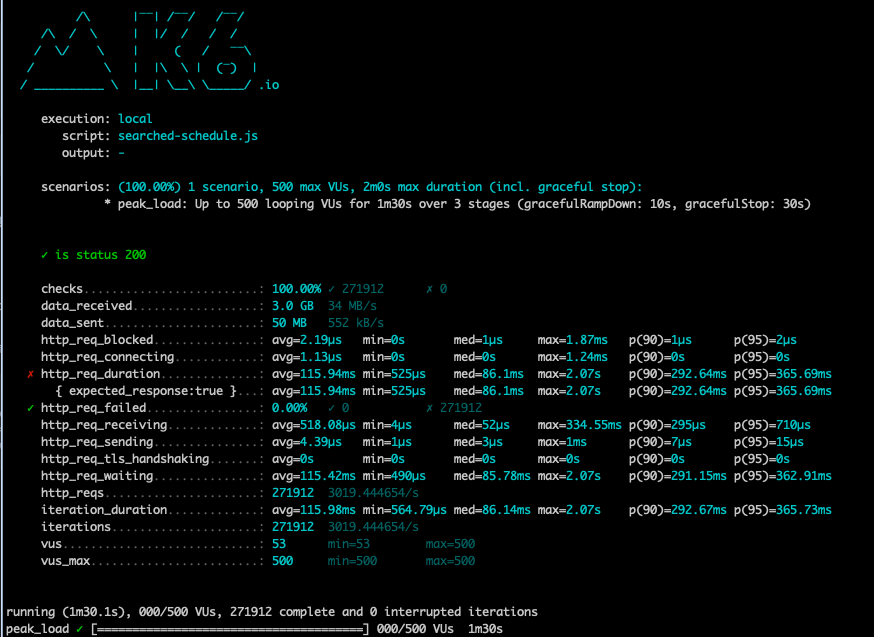

<br>

### movie 복합 인덱스

적용한 복합 인덱스 ddl

```sql
create index idx_title_genre_released_at on movie(title, genre, released_at);
```

- 실행계획

| id | select\_type | table | partitions | type | possible\_keys | key | key\_len | ref | rows | filtered | Extra |
| :--- | :--- | :--- | :--- | :--- | :--- | :--- | :--- | :--- | :--- | :--- | :--- |
| 1 | SIMPLE | me1\_0 | null | range | PRIMARY,idx\_title\_genre\_released\_at | idx\_title\_genre\_released\_at | 484 | null | 11 | 10 | Using index condition; Using filesort |
| 1 | SIMPLE | se1\_0 | null | ref | idx\_theater,idx\_screen,idx\_movie | idx\_movie | 9 | movie.me1\_0.id | 204 | 100 | Using where |
| 1 | SIMPLE | te1\_0 | null | eq\_ref | PRIMARY | PRIMARY | 8 | movie.se1\_0.theater\_id | 1 | 100 | null |
| 1 | SIMPLE | se2\_0 | null | eq\_ref | PRIMARY | PRIMARY | 8 | movie.se1\_0.screen\_id | 1 | 100 | null |

- 부하 테스트 결과

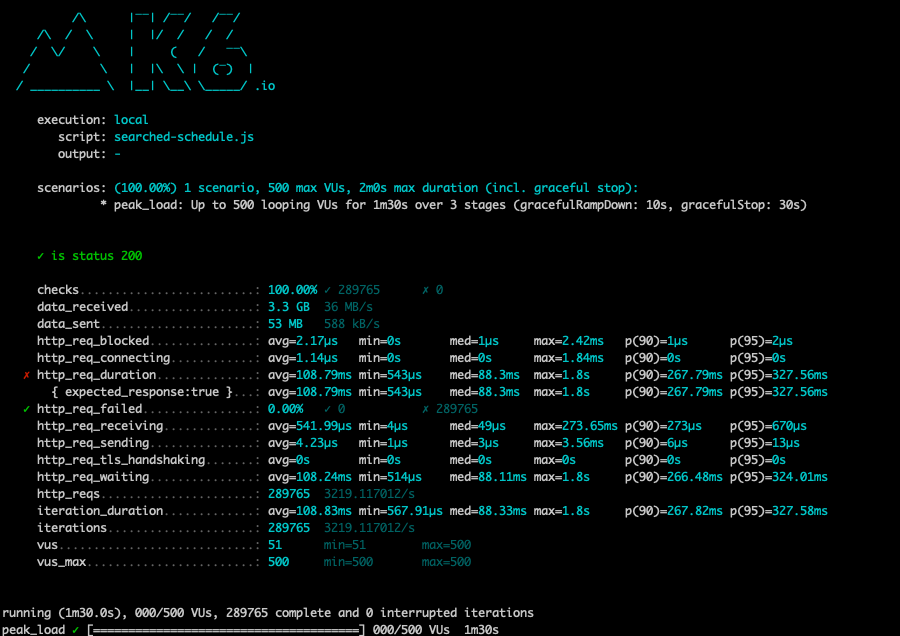

### 결론

- RPS(Request per Second) 비교
  - 단일 인덱스 적용시 평균 RPS: 3,019.44
  - 복합 인덱스 적용시 평균 RPS: 3,219.11
- 응답 시간 (HTTP Response Duration)
  - 단일 인덱스
    - 평균: 115.98ms
    - p(90): 292.67ms
    - p(95): 365.73ms
  - 복합 인덱스
    - 평균: 108.83ms
    - p(90): 267.82ms
    - p(95): 327.58ms 
    
> - 상당한 쿼리 개선 효과는 보이지 못했지만 p(90) 기준 대략 10% 의 성능 향상을 보임
> - RDBMS는 하나의 테이블에 하나의 인덱스를 적용하여 쿼리가 동작하기 때문에 여러개의 인덱스가 존재한다면 그 중 가장 효율적인 인덱스 하나를 선택하여 적용한다.
> - 이때, 복합 인덱스를 적용한다면 쿼리 조회 성능 향상을 기대할 수 있다.

<br>

### Like vs 동등 비교연산자

- like 실행계획

| id | select\_type | table | partitions | type | possible\_keys | key | key\_len | ref | rows | filtered | Extra |
| :--- | :--- | :--- | :--- | :--- | :--- | :--- | :--- | :--- | :--- | :--- | :--- |
| 1 | SIMPLE | me1\_0 | null | range | PRIMARY,idx\_title\_genre\_released\_at | idx\_title\_genre\_released\_at | 484 | null | 10 | 10 | Using index condition; Using temporary; Using filesort |
| 1 | SIMPLE | se1\_0 | null | ALL | idx\_schedule\_theater | null | null | null | 99528 | 10 | Using where; Using join buffer \(hash join\) |
| 1 | SIMPLE | te1\_0 | null | eq\_ref | PRIMARY | PRIMARY | 8 | movie.se1\_0.theater\_id | 1 | 100 | null |
| 1 | SIMPLE | se2\_0 | null | eq\_ref | PRIMARY | PRIMARY | 8 | movie.se1\_0.screen\_id | 1 | 100 | null |


- 동등 연산 실행계획

| id | select\_type | table | partitions | type | possible\_keys | key | key\_len | ref | rows | filtered | Extra |
| :--- | :--- | :--- | :--- | :--- | :--- | :--- | :--- | :--- | :--- | :--- | :--- |
| 1 | SIMPLE | me1\_0 | null | ref | PRIMARY,idx\_title\_genre\_released\_at | idx\_title\_genre\_released\_at | 484 | const,const | 1 | 100 | Using temporary; Using filesort |
| 1 | SIMPLE | se1\_0 | null | ALL | idx\_schedule\_theater | null | null | null | 99528 | 10 | Using where; Using join buffer \(hash join\) |
| 1 | SIMPLE | te1\_0 | null | eq\_ref | PRIMARY | PRIMARY | 8 | movie.se1\_0.theater\_id | 1 | 100 | null |
| 1 | SIMPLE | se2\_0 | null | eq\_ref | PRIMARY | PRIMARY | 8 | movie.se1\_0.screen\_id | 1 | 100 | null |

- 부하 테스트 결과

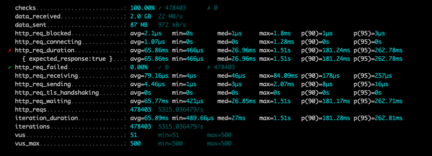

### 결론

- RPS(Request per Second) 비교
  - like 적용시 평균 RPS: 3,219.11/s
  - 동등 비교연산자 적용시 평균 RPS: 5,315.03/s
- 응답 시간 (HTTP Response Duration)
  - like 연산자
    - 평균: 108.83ms
    - p(90): 267.82ms
    - p(95): 327.58ms
  - 동등 비교 연산자
    - 평균: 65.89ms
    - p(90): 181.28ms
    - p(95): 262.81ms

> - like 연산자에 비해 동등 비교연산자를 사용시 p(95) 기준 대략 20%의 조회 쿼리 성능의 향상을 보임

</details>

</details>

<details>
  <summary style="font-weight: bold; font-size: 17px;">캐시 설정 및 부하테스트</summary>

<details>
  <summary style="font-weight: bold; font-size: 15px;">로컬 캐시 & 부하 테스트</summary>

### 로컬 캐시 설정 및 적용

- 적용 캐시 종류 
  - caffeine 캐시
  - 캐시 종료: 10분 (expiredAfterWrite)
  - 캐시 크기: 500

- 총 데이터
  - 장르 : ACTION, ROMANCE, HORROR, SF, ANIMATION (5가지 장르)
  - 영화명: 영화명은 영화1 부터 영화500까지 존재함
  - 테스트
    - 영화1 ~ 영화10 
    - 영화1 ~ 영화100 
    - 영화1 ~ 영화250


### 실행 계획

| id | select\_type | table | partitions | type | possible\_keys | key | key\_len | ref | rows | filtered | Extra |
| :--- | :--- | :--- | :--- | :--- | :--- | :--- | :--- | :--- | :--- | :--- | :--- |
| 1 | SIMPLE | me1\_0 | null | range | PRIMARY,idx\_title\_genre\_released\_at | idx\_title\_genre\_released\_at | 484 | null | 111 | 10 | Using index condition; Using filesort |
| 1 | SIMPLE | se1\_0 | null | ref | idx\_theater,idx\_screen,idx\_movie | idx\_movie | 9 | movie.me1\_0.id | 204 | 100 | Using where |
| 1 | SIMPLE | te1\_0 | null | eq\_ref | PRIMARY | PRIMARY | 8 | movie.se1\_0.theater\_id | 1 | 100 | null |
| 1 | SIMPLE | se2\_0 | null | eq\_ref | PRIMARY | PRIMARY | 8 | movie.se1\_0.screen\_id | 1 | 100 | null |


### 성능 비교

- 영화1 ~ 영화10 (총 10개의 영화), 5가지 장르

#### 부하 테스트 결과

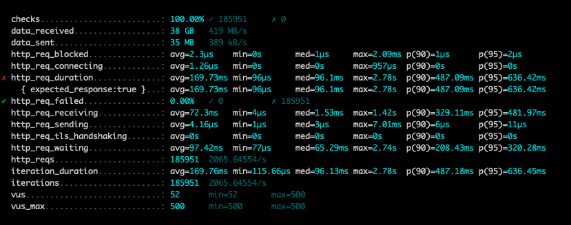

- 영화1 ~ 영화100 (총 100개의 영화), 5가지 장르

#### 부하 테스트 결과

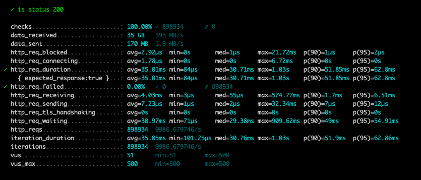

- 영화1 ~ 영화250 (총 250개의 영화), 5가지 장르

#### 부하 테스트 결과

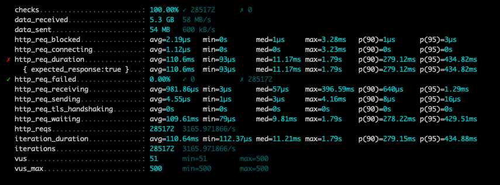

### 결론

> 영화1 ~ 영화100 데이터 검색 시, 가장 좋은 성능을 나타냄

</details>

<details>
  <summary style="font-weight: bold; font-size: 15px;">Redis 캐시 & 부하 테스트</summary>

### 캐시 데이터

- 적용 캐시 종류
  - redis (Lsssecttuce)
  - TTL: 10분

- 총 데이터
  - 장르 : ACTION, ROMANCE, HORROR, SF, ANIMATION (5가지 장르)
  - 영화명: 영화명은 영화1 부터 영화500까지 존재함
  - 테스트
    - 영화1 ~ 영화100
    - 영화1 ~ 영화250
    
### 실행 계획

| id | select\_type | table | partitions | type | possible\_keys | key | key\_len | ref | rows | filtered | Extra |
| :--- | :--- | :--- | :--- | :--- | :--- | :--- | :--- | :--- | :--- | :--- | :--- |
| 1 | SIMPLE | me1\_0 | null | range | PRIMARY,idx\_title\_genre\_released\_at | idx\_title\_genre\_released\_at | 484 | null | 111 | 10 | Using index condition; Using filesort |
| 1 | SIMPLE | se1\_0 | null | ref | idx\_theater,idx\_screen,idx\_movie | idx\_movie | 9 | movie.me1\_0.id | 204 | 100 | Using where |
| 1 | SIMPLE | te1\_0 | null | eq\_ref | PRIMARY | PRIMARY | 8 | movie.se1\_0.theater\_id | 1 | 100 | null |
| 1 | SIMPLE | se2\_0 | null | eq\_ref | PRIMARY | PRIMARY | 8 | movie.se1\_0.screen\_id | 1 | 100 | null |


### 성능 비교

- 영화1 ~ 영화100 (총 100개의 영화), 5가지 장르

부하 테스트 결과

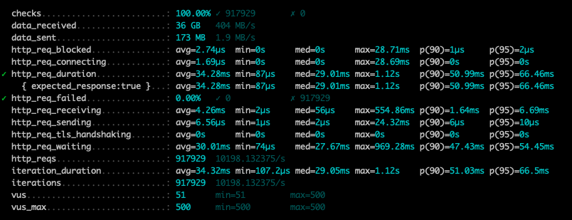

- 영화1 ~ 영화500 (총 250개의 영화), 5가지 장르

부하 테스트 결과

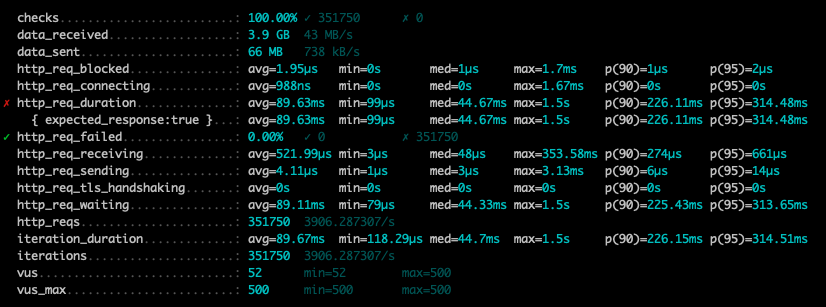

|          | 검색 범위                            | 상능비교 (p(95) 기준) |
|----------|----------------------------------|-----------------|
| 로컬 캐시    | 영화1 ~ 영화250 (총 250개의 영화), 5가지 장르 | 434.88ms        |
| redis 캐시 | 영화1 ~ 영화500 (총 500개의 영화), 5가지 장르 | 314.51ms        |

> 로컬 캐시 대비 redis를 적용한 분산 캐시가 약 25% 이상 빠른 것을 확인함

</details>

</details>

<details>
  <summary style="font-weight: bold; font-size: 17px;">분산락 적용 및 설정 (AOP를 활용한 분산락, 함수형 분산락)</summary>

### AOP 룰 설정한 분산락 성능 테스트
  - 5번의 테스트를 진행하여 평균 약 `920ms`의 성능을 보임

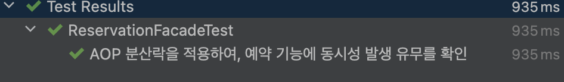


### 함수형 분산락 성능 테스트
  - 5번의 테스트를 진행하여 평균 약 `870ms`의 성능을 보임

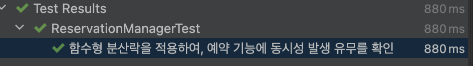

> 함수형 분산락의 성능이 대략 `50ms` 의 빠른 성능을 보임

### AOP 분산락과 함수형 기반 분산락의 속도 차이가 발생하는 이유는 무엇일까?

실행흐름의 차이  
```
// AOP 분산락
AOP 프록시가 메서드 호출을 가로챔 -> 릭 적용 -> 메서드 실행

// 함수형 기반 분산락
메서드 내부에서 직접 함수형 분산락 실행 -> 락 적용 후 실행
```
AOP 기반은 메서드 호출을 감싸는 프록시가 만들어져 있고, 함수형 기반은 메서드 내부에서 직접 락을 적용하한 후 실행하기 때문에 속도의 차이가 발생한다.

### waitTime, leaseTime

하나의 예약 API 호출시 많게는 900ms 적게는 800ms의 속도를 보였다. 락을 획득하기 위해 대기하는 `waitTime`은 1초로도 충분하지만 
5초로 주어 락을 순차적으로 가져갈 수 있도록 하였으며, leaseTime 또한 5초를 주어 획득한 락 내에 충분히 API가 처리될 수 있도록 보장함

### 

</details>

<details>
  <summary style="font-weight: bold; font-size: 17px;">Jacoco 테스트 결과</summary>

> jacoco 테스트를 진행한 모듈은 movie-api, movie-domain. movie-storage 이다.

### Api

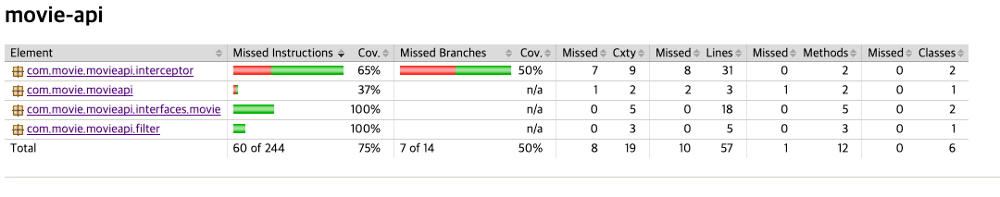

- 통합 테스트를 진행하였으며 작성된 테스트 코드 클래스는 아래와 같다.
  - ScheduleControllerTest
  - ReservationControllerTest

>interfaces 에 위치하는 controller 의 테스트 커버리지를 80% 이상 향상 시키도록 테스트 케이스를 작성했으며, 100%으로 테스트 통과율을 보임

### Domain

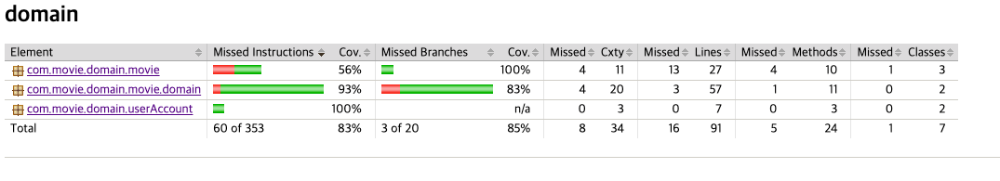

- Mock 테스트를 진행하였으며, 테스트를 작성한 클래스는 아래와 같다.
  - SeatTest
    - 5자리 이상 예약 시도 유효성 테스트
    - 연속된 자리 예약 시도 유효성 테스트
  - ReservationTest
    - 이미 점유된 좌석 확인 테스트
    - 점유되지 않은 좌석이라면 예약이 가능한지 테스트
  - ScheduleServiceTest
    - 영화관 id를 이용한 스케줄 목록조회 테스트
    - 영화명, 장르를 이용한 스케줄 목록조회 테스트
    - 영화관, 장르를 이용하여, 인메모리 캐시에서 스케줄 목록조회 테스트
    - 영화관, 장르를 이용하여, Redis 캐시에서 스케줄 목록조회 테스트
  - ReservationServiceTest
    - 스케줄 id와 좌석 ids를 이용하여 예약 목록조회 테스트
    - 스케줄 id, 좌석 ids, 사용자 id로 좌석 예약 테스트
  - UserAccountServiceTest
    - token을 이용한 단일 사용자 조회 테스트

> 도메인 또한 80% 이상의 커버리지를 확인함

### Storage 테스트

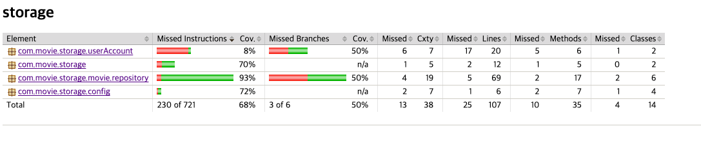

- 통합 테스트로 진행했으며, 테스트 코드를 작성한 클래스는 아래와 같다.
  - ScheduleRepositoryTest
    - 영화관 id를 이용한 스케줄 목록조회
    - 영화명, 장르를 이용한 스케줄 목록조회
  - ReservationRepositoryTest
    - 스케줄 id, 좌석 ids를 이용한 예약정보 목록조회
    - 스케줄 id, 좌석 ids, 사용자 id를 이용한 좌석 예약
  - UserAccountRepositoryTest
    - token을 이용한 단일 사용자 조회

> instruction & Branch Coverage 를 50% 이상 보임


</details>

