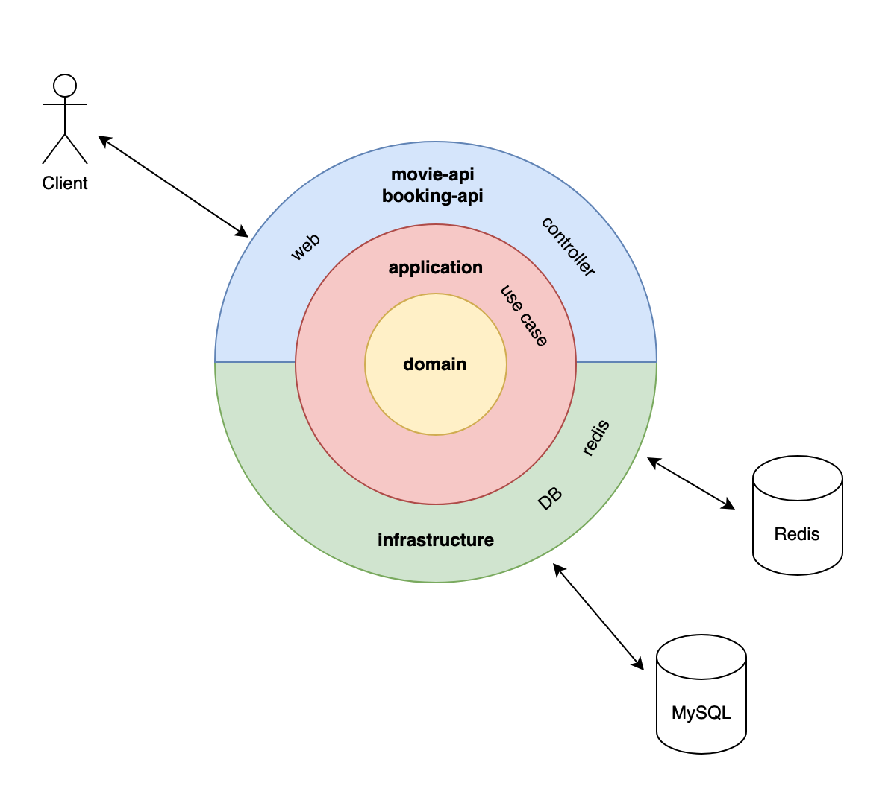
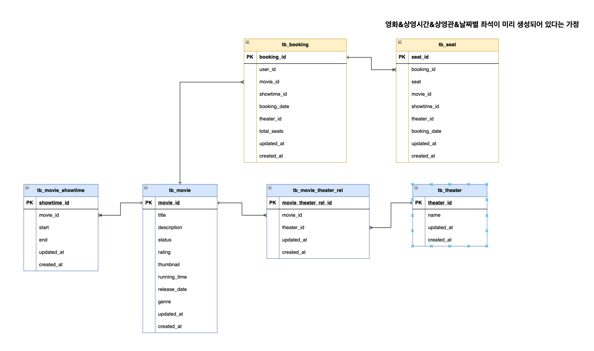
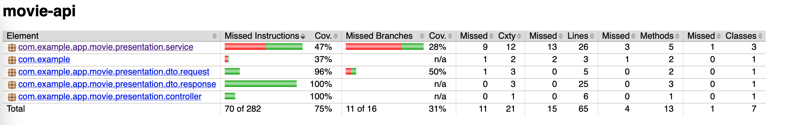
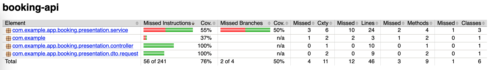
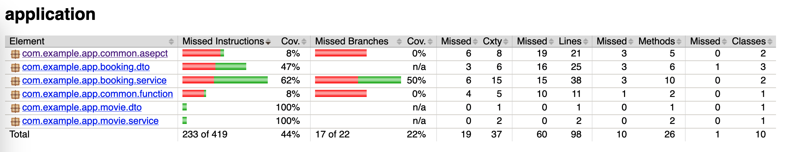
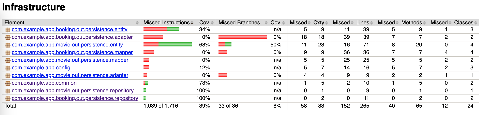

# [본 과정] 이커머스 핵심 프로세스 구현

## How to use

```bash
docker compose up -d
```
```bash
curl -X GET http://localhost:8080/api/v1/movies
```

## Multi Module

### 1-1. movie-api
> 영화 도메인 presentation 담당합니다.

### 1-2. booking-api
> 예약 도메인 presentation 담당합니다.

### 2. application
> Use Case 생성을 담당합니다.

### 3. infrastructure
> DB 연결과 Entity 관리를 담당합니다.

### 4. domain
> 도메인 로직을 포함합니다.

## Architecture
> 클린 아키텍처를 지향합니다.



## Table Design


## 성능 테스트
### 캐싱할 데이터

> API 응답을 캐싱하였습니다.

```json
// 응답 예시
[
  {
    "id": 0,
    "title": "나 홀로 집에",
    "description": "...",
    "rating": "전체관람가",
    "genre": "코미디",
    "thumbnail": "https://...",
    "runningTime": 103,
    "releaseDate": "1991-07-06",
    "theaters": ["강남점", "안양점"],
    "showtimes": ["08:00 ~ 09:45", "10:00 ~ 11:45"]
  }
]
```

### 분산락
> Lease Time 길게 잡을수록 한 스레드가 lock을 오래 잡고 있어, 동시성 성능 테스트할때 fail 요청률이 90% 이상 나왔습니다.
> 
> Wait Time 경우 좌석 예매 특성상 오래 기다린다고 예약이 되는건 아니라 Lease Time보다 낮게 잡았습니다.
- Lease Time - 2초 
- Wait Time - 1초

### 보고서
- [캐싱 성능 테스트 보고서](https://gusty-football-62b.notion.site/17f81b29f03680718163fe0b7798383e)
- [분산락 테스트 보고서](https://gusty-football-62b.notion.site/18781b29f03680049de7db34240a6733)

### jacoco 리포트

| movie-api                  | booking-api | application                | infrastructure             | domain                      |
|----------------------------| ----------- |----------------------------|----------------------------|-----------------------------|
 |  |  |  |  | 로직이란게 없고 객체만 있어. 일단 스킵했습니다. |