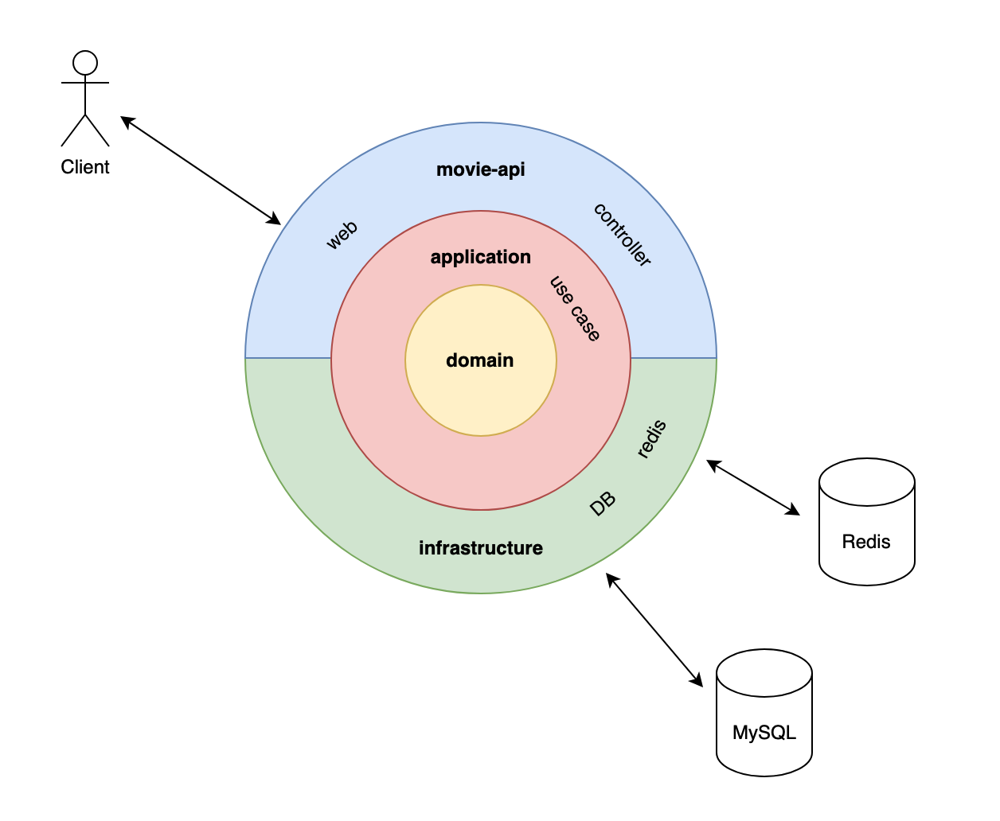
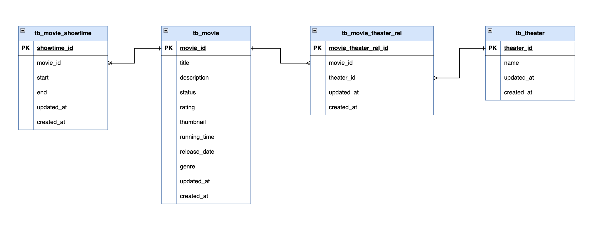

# [본 과정] 이커머스 핵심 프로세스 구현

## How to use

```bash
docker compose up -d
```
```bash
curl -X GET http://localhost:8080/api/v1/movies
```

## Multi Module

### 1. movie-api
> 영화 도메인 presentation 담당합니다.

- GET /api/v1/movies?title=집에&genre=COMEDY

```json
// 응답 예시
[
  {
    "id": 0,
    "title": "나 홀로 집에",
    "description": "...",
    "rating": "전체관람가",
    "genre": "코미디",
    "thumbnail": "https://...",
    "runningTime": 103,
    "releaseDate": "1991-07-06",
    "theaters": ["강남점", "안양점"],
    "showtimes": ["08:00 ~ 09:45", "10:00 ~ 11:45"]
  }
]
```
### 2. application
> Use Case 생성을 담당합니다.

### 3. infrastructure
> DB 연결과 Entity 관리를 담당합니다.

### 4. domain
> 도메인 로직을 포함합니다.

## Architecture
> 클린 아키텍처를 최대한 따라했습니다.



## Table Design
