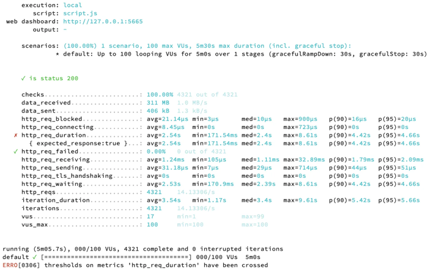

## Multi Module Design
Module을 나누는 기준은 여러 개가 있지만, 이번 프로젝트에서는 Layered Architecture 에서 설명되는 Layer 별로 구분하였습니다.
- module-presentation: 사용자의 요청을 받고, 응답한다.
- module-application: 사용자가 요청한 기능을 처리한다. 
- module-domain: 시스템이 제공할 도메인 규칙을 구현한다.
- module-infra: 데이터베이스 같은 외부 시스템과의 연동을 처리한다.
- module-core: Convertor, Error-Response 와 같이 특정 layer에 종속되지 않는 기능을 처리한다.

각 module은 하위 module에만 의존합니다.  
JPA에서 다른 기술로 변경될 것이라고 생각하여 DIP를 적용하는 것은 오버 엔지니어링이라고 생각되어, JPA 기술에 종속되지 않는 POJO 객체들을 생성하지 않고, 도메인 계층에 infra 계층에 종속되는 코드로 구현하였습니다. (@Entity 클래스, JpaRepository 등)

## Table Design

- Movie 테이블과 Theater 테이블은 N:N 관계로 중간에 Screening 테이블을 두고 있습니다.
  - Theater 별로 시간표가 구분되는 것을 고려하여 Screening 테이블은 상영 시간표 정보를 포함하고 있습니다.
- 좌석별 등급 등 좌석 개별의 특성이 추가될 수 있다고 생각하여 Seat 테이블을 생성하였습니다.
- Theater 테이블과 Seat 테이블은 1:N 관계입니다.
- Seat 테이블과 User 테이블은 1:N 관계입니다.

## N+1 문제 해결
저는 N+1 문제가 ID 참조을 사용하기 때문이라고 생각합니다. 따라서 해당 프로젝트에 간접참조를 사용하여, N+1 문제를 해결하고자 합니다. 뿐만 아니라, 간접 참조를 사용하면 도메인 간 물리적인 연결을 제거하기 때문에 도메인 간 의존을 강제적으로 제거합니다.