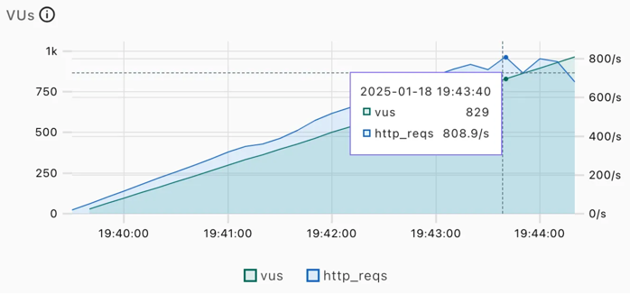
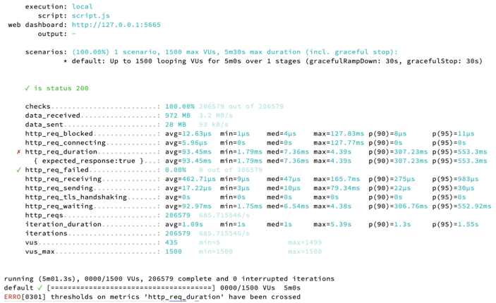
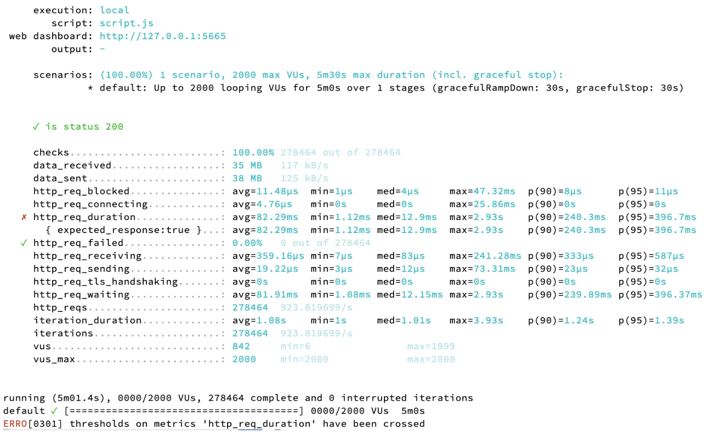

## Multi Module Design
Module을 나누는 기준은 여러 개가 있지만, 이번 프로젝트에서는 Layered Architecture 에서 설명되는 Layer 별로 구분하였습니다.
- api: 사용자의 요청을 받고, 응답한다. 
  - 본래, presentation과 application 두 개의 모듈로 분리되어있던 구조를 수정하였습니다.
  - 사용자의 요청을 받고 처리한다는 점에서, Error와 Response를 한 곳에서 관리하기 위함입니다.
- domain: 시스템이 제공할 도메인 규칙을 구현한다.
- infra: 외부 시스템과의 연동을 담당한다.
- 본래 존재하였던 core 모듈을 삭제하였습니다.
  - 실제로 공통 역할이 아니지만 core(or common) 모듈에 패키지를 생성해서 정의하는 경우를 방지하기 위함입니다.
  - 현재까지의 요구사항에서는 core 모듈에 들어갈 기능이 없다고 판단되었습니다.

각 module은 하위 module에만 의존합니다. <br>
JPA 를 다른 ORM 으로 변경될 가능성은 낮다고 판단하여 PA 는 생산성을 위해서 Entity 와 Repository 를 Domain 으로 끌어 올려 사용하였습니다.
JPA 를 제외한 나머지는 저수준의 변경사항으로 부터 고수준을 지키는 방식을 사용합니다.

## Table Design

- Movie 테이블과 Theater 테이블은 N:N 관계로 중간에 Screening 테이블을 두고 있습니다.
  - Theater 별로 시간표가 구분되는 것을 고려하여 Screening 테이블은 상영 시간표 정보를 포함하고 있습니다.
- 좌석별 등급 등 좌석 개별의 특성이 추가될 수 있다고 생각하여 Seat 테이블을 생성하였습니다.
- Theater 테이블과 Seat 테이블은 1:N 관계입니다.
- Seat 테이블과 Reservation 테이블은 1:1 관계입니다.
  - 공유 자원인 Seat과 행위인 Reservation을 분리하기 위함입니다.
- Reservation 테이블과 User 테이블은 1:1 관계입니다.

## N+1 문제 해결
저는 N+1 문제가 ID 참조을 사용하기 때문이라고 생각합니다. 따라서 해당 프로젝트에 간접참조를 사용하여, N+1 문제를 해결하고자 합니다. 
뿐만 아니라, 간접 참조를 사용하면 도메인 간 물리적인 연결을 제거하기 때문에 도메인 간 의존을 강제적으로 제거되고, FK의 데이터 정합성을 따지기 위한 성능 오버헤드를 줄이며, 데이터 수정 시의 작업 순서가 강제됨에 따라 발생하는 더 큰 수정 개발을 방지할 수 있습니다.

대신, 애플리케이션 단에서 무결성 관리를 관리하도록 합니다. (삽입/수정/삭제)

## 성능 테스트 보고서
- DAU: 500명
- duration : '5m' 으로 진행
- 95% 요청이 200ms 이하, 실패율 1% 이하를 thresholds로 추가
### 1. INDEX 적용 전
- 영화 300개, 상영관 4개, 시간표 1,000개
- 실행 계획
```sql
EXPLAIN ANALYZE SELECT m.id, m.name, m.grade, m.release_date, m.thumbnail, m.running_time, m.genre, t.id, t.name, s.start_at, s.end_at FROM movie m JOIN screening s ON m.id = s.movie_id JOIN theater t ON s.theater_id = t.id WHERE s.start_at >= NOW();
```
 

-> 풀테이블 스캔 전략
- 부하테스트 <br>


-> 95% 응답 시간이 1.1s 이므로 실패

### 2. INDEX 적용 후
- Screening 테이블에 start_at에 대한 인덱스 생성
- 영화 300개, 상영관 4개, 시간표 1,000개
- 실행 계획 <br>


-> 인덱스 레인지 전략
- 부하테스트 <br>


-> 95% 응답 시간이 12.67ms로, 성능이 약 86배 향상

### 3. Local Caching 적용 후
* 현재 상영 중인 영화 조회 쿼리는, LocalDateTime을 기준으로 필터링하기 때문에, 캐싱에 의미가 없습니다. 따라서, start_at 기준을 뺀, 상영중인 영화가 아닌 모든 영화를 조회하는 API를 가지고 캐싱을 진행하였습니다.
=> nowShowing에 대한 쿼리 파라미터를 추가하여 TRUE이면 상영중인 영화, FALSE 이면 모든 영화가 조회되도록 코드를 수정하였습니다.
- 데이터를 영화 500개, 상영관 3개, 시간표 3,000개로 늘렸습니다.
- 실행 계획
```sql
EXPLAIN ANALYZE SELECT m.id, m.name, m.grade, m.release_date, m.thumbnail, m.running_time, m.genre, t.id, t.name, s.start_at, s.end_at FROM movie m JOIN screening s ON m.id = s.movie_id JOIN theater t ON s.theater_id = t.id WHERE m.genre = 'HORROR' AND m.name LIKE '%3%';
```

- 성능 개선 전 부하 테스트(쿼리가 수정되고 데이터가 늘어나서 다시 수행) <br>


-> 95%의 응답 시간이 747.93ms 이므로 실패
- 로컬 캐싱 적용 후 부하 테스트 <br>


-> 95%의 응답 시간이 6.38ms 로, 성능이 약 117배 향상되었습니다.

### 4. Global Caching 적용 후 


-> 95%의 응답 시간이 7.33ms로, 로컬 캐싱보다는 느리지만 캐싱 적용 전보다 훨씬 성능이 향상되었습니다. 