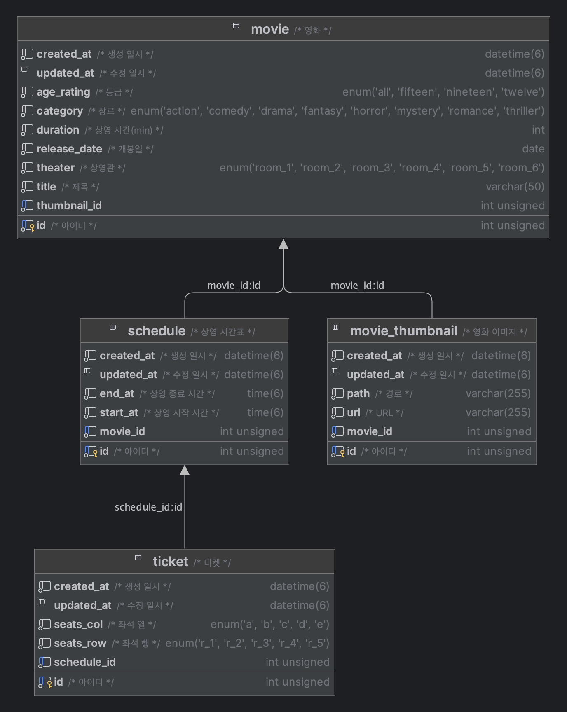

## [본 과정] 이커머스 핵심 프로세스 구현
[단기 스킬업 Redis 교육 과정](https://hh-skillup.oopy.io/) 을 통해 상품 조회 및 주문 과정을 구현하며 현업에서 발생하는 문제를 Redis의 핵심 기술을 통해 해결합니다.
> Indexing, Caching을 통한 성능 개선 / 단계별 락 구현을 통한 동시성 이슈 해결 (낙관적/비관적 락, 분산락 등)

## 개발 환경 및 라이브러리
- Java 17
- Spring Boot 3.4.1
- Spring Data JPA / Hibernate
- Mysql

## 폴더별 설명
- **common** : 공통적으로 사용되는 클래스 및 설정
- **domain** : 도메인 로직 구현
- **application** : 도메인 로직을 이용한 비즈니스 로직 구현
- **api** : 비즈니스 로직을 이용한 API 구현
- **docker** : mysql 컨테이너 구성
- **http-request** : API 호출을 위한 http request 파일

## 의존성 흐름
:domain -> :application -> :api

## 구현 기능
- 상영 영화 목록 조회

## ERD


## PRE RUN
```shell
  docker compose -f ./docker/docker-compose.yml up
```

## RUN API
```shell
  ./gradlew api:bootrun
```

## 성능 최적화
- `default_batch_fetch_size` 설정을 통한 N+1 문제 해결 및 성능 최적화, 코드 간략화
    - [김영한님의 default_batch_fetch_size Q&A](https://www.inflearn.com/community/questions/34469/default-batch-fetch-size-%EA%B4%80%EB%A0%A8%EC%A7%88%EB%AC%B8)
    - [[번역] Batch Fetching - 객체 그래프 로딩을 최적화 하기 (JPA/ECLIPSELINK)](https://narusas.github.io/2017/11/21/Eclipselink_Batch_Fetch.html)
    - [hibernate 6.x 에서 batch size의 전략 변경하기 아는 분 있으신가요?(batch_fetch_style deprecated issue)](https://www.inflearn.com/community/questions/903628/19-04-%EC%B4%88-where-in-%EC%BF%BC%EB%A6%AC-%EB%8C%80%EC%8B%A0-where-array-conatins-%EC%BF%BC%EB%A6%AC%EA%B0%80-%EB%82%98%EC%99%94%EC%8A%B5%EB%8B%88%EB%8B%A4-%EC%8A%A4%ED%94%84%EB%A7%81-%EB%B6%80%ED%8A%B8-3-1)
    - 실제로 GET ~/api/movies 호출시 날아가는 쿼리
```sql
  SET SESSION TRANSACTION READ ONLY;

SET autocommit = 0;

select m1_0.id, m1_0.age_rating, m1_0.category, m1_0.created_at, m1_0.duration,
m1_0.release_date, m1_0.theater, m1_0.thumbnail_id, m1_0.title, m1_0.updated_at
from movie m1_0
order by m1_0.release_date desc;

select mt1_0.id, mt1_0.created_at, mt1_0.movie_id, mt1_0.path, mt1_0.updated_at, mt1_0.url
from movie_thumbnail mt1_0
where mt1_0.id in
(1, 10, 9, 8, 7, 6, 5, 4, 3, 2, null, null, null, null, null, null, null, null, null, null,
null, null, null, null, null, null, null, null, null, null, null, null, null, null, null,
null, null, null, null, null, null, null, null, null, null, null, null, null, null, null,
null, null, null, null, null, null, null, null, null, null, null, null, null, null, null,
null, null, null, null, null, null, null, null, null, null, null, null, null, null, null,
null, null, null, null, null, null, null, null, null, null, null, null, null, null, null,
null, null, null, null, null);

select s1_0.movie_id, s1_0.id, s1_0.created_at, s1_0.end_at, s1_0.start_at, s1_0.updated_at
from schedule s1_0
where s1_0.movie_id in
(10, 9, 8, 7, 6, 5, 4, 3, 2, 1, null, null, null, null, null, null, null, null, null, null,
null, null, null, null, null, null, null, null, null, null, null, null, null, null, null,
null, null, null, null, null, null, null, null, null, null, null, null, null, null, null,
null, null, null, null, null, null, null, null, null, null, null, null, null, null, null,
null, null, null, null, null, null, null, null, null, null, null, null, null, null, null,
null, null, null, null, null, null, null, null, null, null, null, null, null, null, null,
null, null, null, null, null)
order by s1_0.start_at;

COMMIT;

SET autocommit = 1;

SET SESSION TRANSACTION READ WRITE;

 ```
