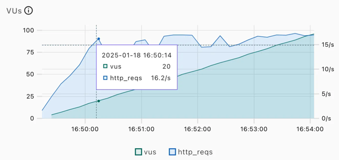

## [본 과정] 이커머스 핵심 프로세스 구현
[단기 스킬업 Redis 교육 과정](https://hh-skillup.oopy.io/) 을 통해 상품 조회 및 주문 과정을 구현하며 현업에서 발생하는 문제를 Redis의 핵심 기술을 통해 해결합니다.
> Indexing, Caching을 통한 성능 개선 / 단계별 락 구현을 통한 동시성 이슈 해결 (낙관적/비관적 락, 분산락 등)

# Architecture
Layered Architecture를 적용했습니다.

# Multi-Module
### module-api
클라이언트의 요청 및 응답을 처리해줍니다. 
처리 결과를 반환하기 위한 비즈니스 로직을 처리합니다.

### module-domain
테이블과 매핑된 도메인을 관리하고 도메인 관련 핵심 비즈니스 로직을 처리합니다. 
데이터 접근을 위한 인터페이스를 관리합니다.

### module-infra
domain 모듈에서 관리하는 인터페이스를 구현한 클래스를 관리합니다.

### module-core
다른 모듈들에서 공통으로 사용되는 클래스들을 모아두기 위한 모듈입니다.

# Table Design

### Movie 테이블
제목, 썸네일, 장르, 등급, 개봉일, 러닝타임 등 영화 정보를 담고 있는 테이블입니다.

### ScreenSchedule 테이블
영화가 시작하는 시간과 끝나는 시간 정보를 담고 있는 테이블입니다.

### ScreenRoom 테이블
상영관 이름을 담고 있는 테이블입니다.

### Users 테이블
사용자 정보를 담고 있는 테이블입니다.

### Reservation 테이블
사용자가 예매한 시간과 좌석 정보를 담고 있는 테이블입니다.

### 관계
- 영화와 상영시간표 (1:N)
  - 하나의 영화는 여러 개의 상영 시간표를 가질 수 있습니다.

- 상영관과 상영시간표 (1:N)
  - 하나의 상영관은 여러 개의 상영 시간표에 배정될 수 있습니다.

- 상영관과 예매내역 (1:N)
  - 하나의 상영관은 여러 개의 예매 내역에 포함될 수 있습니다.

- 사용자과 예매내역 (1:N)
  - 하나의 사용자는 여러 개의 예매 내역을 가질 수 있습니다.

### 생각해본 것
구현하다 보니까 상영관 테이블이 없어도 될 것 같다는 생각이 들었습니다. 
현재 상영관에 관한 요구사항이 없기 때문에 상영관 테이블에는 이름 속성 하나만 있습니다.
하나의 속성만 갖고, 상영시간표 테이블과 비슷한 목적으로 만들어진 테이블을 하나 더 만드는 것이 성능 측면에서 안좋을 것이라고 생각하였습니다.

